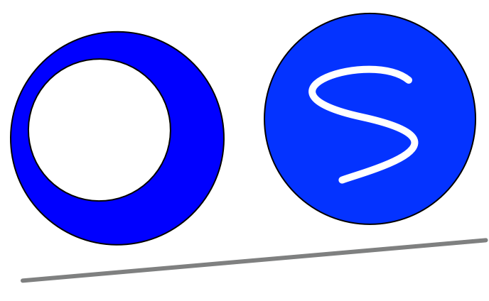

Project Mitosis OS is a set of systems based on a new operating system primitive - "Remote Fork".

This repo contains an overview of the whole project.

## Systems

Penglai contains a set of different systems:

- **KRCore**: the kernel-mode RDMA communication library on which our systems depend on.

- **Mitosis-Core**: the core repo which provides the "Remote Fork" system primitive. 

## Features

We support fast process/container fork (over 10,000 new containers from one instance in the cluster across multiple machines within a second).

We have integrated it into a serverless system, and we hope to integrate it to more systems.

## Quick Start

TODO

## License Details

TODO

## Collaborators

We thank all of our collaborators (companies, organizations, and communities).
